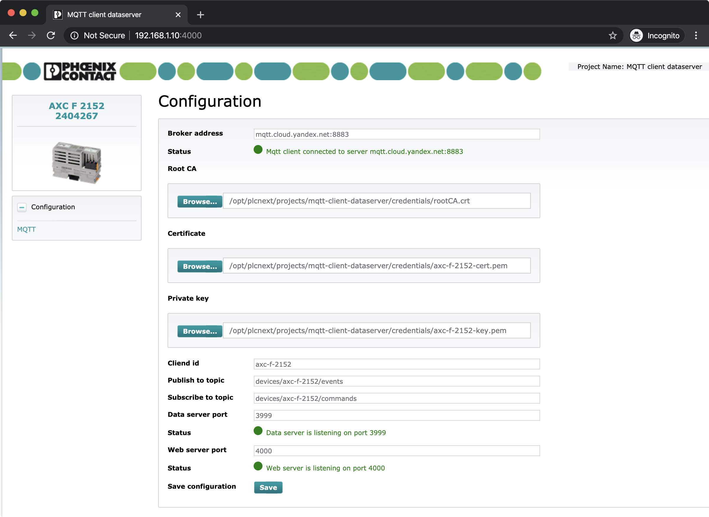

# PLCnext Node.js MQTT client

## In Russian
[In English ↓](#in-english)

### Описание
Приложение предназначено для контроллеров на базе [PLCnext Technology](https://www.phoenixcontact.com/plcnext/) и 
действует как MQTT клиент, перенаправляя в MQTT брокер сообщения из рантайма IEC 61131-3.

Приложение написано для Node.js и требует предварительной [установки](https://github.com/axhelp/plcnext-nodejs-installer) 
среды исполнения [Node.js](https://nodejs.org/en/) и менеджера процессов [pm2](https://pm2.io). Во время установки 
контроллер должен иметь активное интернет-подключение.

### Процедура установки
#### Копирование файла
Для запуска процедуры установки необходимо скопировать файл `mqtt-client-dataserver-installer.sh` в файловую систему 
контроллера.
IP адрес по-умолчанию `192.168.1.10`, пароль по-умолчанию указан на корпусе.

##### Linux/Mac OS:
```bash
scp mqtt-client-dataserver-installer.sh admin@192.168.1.10:/opt/plcnext
```

##### Windows
Воспользуйтесь [инструкцией](https://www.plcnext-community.net/index.php?option=com_content&view=article&id=58:how-to-use-winscp-2) 
по использованию утилиты [WinSCP](https://winscp.net/eng/download.php)

#### Запуск
Установить ему права на исполнение и запустить от пользователя `root`.

```bash
# Логин от имени пользователя root
su

# Установка прав на исполнение файла
chmod +x mqtt-client-dataserver-installer.sh

# Запуск файла
./mqtt-client-dataserver-installer.sh
```

#### Конфигурация
После установки приложение запускается менеджером процессов pm2 и открывает Web сервер для конфигурации на порту `4000`, 
либо на указанном в конфигурационном файле `/opt/plcnext/projects/mqtt-client-dataserver/settings.json`

Интерфейс настройки доступен по ссылке [http://192.168.1.10:4000](http://192.168.1.10:4000) (если IP адрес контроллера 
`192.168.1.10`)


#### Разработка 
Установка зависисмостей и запуск в режиме разработки:
```bash
cd server
npm install

cd ../frontend
npm install

npm npm run start-dev
```


## In English
[На русском ↑](#in-russian)

### Overview
Application is intended to run on [PLCnext Technology](https://www.phoenixcontact.com/plcnext/) based PLC's from Phoenix 
Contact and acts as MQTT client, forwarding messages from IEC 61131-3 runtime to MQTT broker. 

Application is using Node.js runtime and required an [installation](https://github.com/axhelp/plcnext-nodejs-installer) 
of [Node.js](https://nodejs.org/en/) and [pm2](https://pm2.io) process manager. PLC should have an active internet 
connection during the installation procedure.


### Installation procedure
#### File copy
Copy `plcnext-nodejs-installer.sh` file into PLC file system.
Default IP address is `192.168.1.10`, default password is printed on PLC.

##### Linux/Mac OS:
```bash
scp mqtt-client-dataserver-installer.sh admin@192.168.1.10:/opt/plcnext
```

##### Windows
Take a look into [short instruction](https://www.plcnext-community.net/index.php?option=com_content&view=article&id=58:how-to-use-winscp-2) how to use [WinSCP](https://winscp.net/eng/download.php) utility.

#### Script execution
Change the file access permission and execute it as `root` user.

```bash
# Login as root
su

# Change file permission to execute
chmod +x mqtt-client-dataserver-installer.sh

# Execute script
./mqtt-client-dataserver-installer.sh
```

#### Configuration
After the installation, application is launched by p2 process manager and listen as Web server on port `4000`, or another 
if specified in `/opt/plcnext/projects/mqtt-client-dataserver/settings.json` configuration file.

После установки приложение запускается менеджером процессов pm2 и открывает Web сервер для конфигурации на порту `4000`, 
либо на указанном в конфигурационном файле `/opt/plcnext/projects/mqtt-client-dataserver/settings.json`

Web interface is accessible via link [http://192.168.1.10:4000](http://192.168.1.10:4000) (if PLC IP address is
`192.168.1.10`)


#### Development 
Required packages installation and running in development mode:
```bash
cd server
npm install

cd ../frontend
npm install

npm npm run start-dev
```
