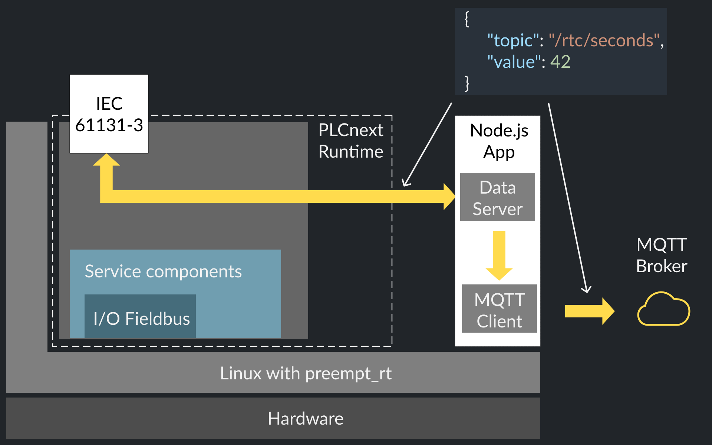

# PLCnext Node.js MQTT client

## In Russian
[In English ↓](#in-english)

### Описание
Приложение предназначено для контроллеров на базе [PLCnext Technology](https://www.phoenixcontact.com/plcnext/) и
действует как MQTT клиент, перенаправляя в MQTT брокер сообщения из рантайма IEC 61131-3.

Приложение написано для Node.js и требует предварительной [установки](https://github.com/axhelp/plcnext-nodejs-installer)
среды исполнения [Node.js](https://nodejs.org/en/) и менеджера процессов [pm2](https://pm2.io), либо запускается в
изолированном Docker / Balena Engine контейнере. Во время установки контроллер должен иметь активное интернет-подключение.

### Процедура установки
Приложение может быть запущено
- [В изолированном Docker / Balena Engine контейнере](#запуск-в-balena-engine-контейнере)
- [Менеджером процессов pm2](#запуск-в-менеджере-процессов-pm2)

### Запуск в Balena Engine контейнере
- Следуйте [инструкции](https://github.com/PLCnext/Docker_GettingStarted/blob/master/getting-started/Part-01/README.md)
- Измените файл `/etc/nftables/balena.nft` в соответствии с подсетью интерфейса `balena0`
```
root@axcf2152:/opt/plcnext/# ifconfig
balena0   Link encap:Ethernet  HWaddr 02:42:B7:8F:11:70
          inet addr:172.17.0.1  Bcast:172.17.255.255  Mask:255.255.0.0
          inet6 addr: fe80::42:b7ff:fe8f:1170/64 Scope:Link
          UP BROADCAST MULTICAST  MTU:1500  Metric:1
          RX packets:411 errors:0 dropped:0 overruns:0 frame:0
          TX packets:37 errors:0 dropped:0 overruns:0 carrier:0
          collisions:0 txqueuelen:0
          RX bytes:26172 (25.5 KiB)  TX bytes:2634 (2.5 KiB)


root@axcf2152:/opt/plcnext/# nano /etc/nftables/balena.nft

#!/usr/sbin/nft -f
define balena_v4 = 172.17.0.0/24

table ip balena {
  chain balena_forward {
    # default forward policy is drop
    type filter hook forward priority 0; policy drop;
    ip saddr $balena_v4 oif eth0 accept
    # accept any established connection traffic
    ct state established,related accept
  }

  chain prerouting {
    type nat hook prerouting priority 0;
  }

  chain postrouting {
    type nat hook postrouting priority 0;
    # apply source nat for balena traffic to the internet
    ip saddr $balena_v4 oif eth0 masquerade
  }
}
```
- Если активирован Firewall, откройте для приложения входящий порт (по-умолчанию 3000)
    - Через [страницу на Web интерфейсе](https://192.168.1.10/wbm/Main.html#Firewall.html)
    - Через [файл конфигурации](https://github.com/PLCnext/Docker_GettingStarted/tree/master/getting-started/Part-02)

- Запустите контейнер
```
balena-engine run -d \
    --name=mqtt-client-dataserver \
    --restart=always \
    -p 3999:3999 \
    -p 4000:4000 \
    axhelp/mqtt-client-dataserver:latest
```

### Запуск в менеджере процессов pm2

#### Копирование файла
Для запуска процедуры установки необходимо скопировать файл `mqtt-client-dataserver-installer.sh` в файловую систему
контроллера.
IP адрес по-умолчанию `192.168.1.10`, пароль по-умолчанию указан на корпусе.

###### Linux/Mac OS:
```bash
scp mqtt-client-dataserver-installer.sh admin@192.168.1.10:/opt/plcnext
```

###### Windows
Воспользуйтесь [инструкцией](https://www.plcnext-community.net/index.php?option=com_content&view=article&id=58:how-to-use-winscp-2)
по использованию утилиты [WinSCP](https://winscp.net/eng/download.php)

##### Запуск установщика
Установить файлу `mqtt-client-dataserver-installer.sh` права на исполнение и запустить от пользователя `root`.

```bash
# Логин от имени пользователя root
su

# Установка прав на исполнение файла
chmod +x mqtt-client-dataserver-installer.sh

# Запуск файла
./mqtt-client-dataserver-installer.sh
```

#### Конфигурация
После установки приложение запускается менеджером процессов pm2 и открывает Web сервер для конфигурации на порту `4000`,
либо на указанном в конфигурационном файле `/opt/plcnext/projects/mqtt-client-dataserver/settings.json`

Интерфейс настройки доступен по ссылке [http://192.168.1.10:4000](http://192.168.1.10:4000) (если IP адрес контроллера
`192.168.1.10`)


### Отправка сообщений
Для отправки сообщений из рантайма IEC 61131-3 необходимо функциональным блоком `TCP_SOCKET` установить TCP соединение с `Data Server` и отправлять функциональным блоком `TCP_SEND` сообщения в формате JSON, например:
```json
{
     "topic": "/rtc/seconds",
     "value": 42
}
```



[Пример](plcnext-engineer/src) программы для рантайма IEC 61131-3 состоит из:
-  Функционального блока [TcpClient](plcnext-engineer/src/mqtt-client-exampleFlat/content/TcpClient.pou~Code~0000.st) для соединения с `Data Server` и отправки сообщений
-  Функционального блока [EncodeIntegerValue](/plcnext-engineer/src/mqtt-client-exampleFlat/content/EncodeIntegerVa~Code~0000.st) для формирования сообщения
-  Программы [Main](plcnext-engineer/src/mqtt-client-exampleFlat/content/Main.pou~Code~0000.st), соединяющей блоки друг с другом


#### Разработка
Установка зависисмостей и запуск в режиме разработки:
```bash
cd server
npm install

cd ../frontend
npm install

npm run start-dev
```


## In English
[На русском ↑](#in-russian)

### Overview
Application is intended to run on [PLCnext Technology](https://www.phoenixcontact.com/plcnext/) based PLC's from Phoenix
Contact and acts as MQTT client, forwarding messages from IEC 61131-3 runtime to MQTT broker.

Application is using Node.js runtime and required an [installation](https://github.com/axhelp/plcnext-nodejs-installer)
of [Node.js](https://nodejs.org/en/) and [pm2](https://pm2.io) process manager, or can run inside isolated Docker /
Balena Engine container. PLC should have an active internet connection during the installation procedure.


### Installation procedure
Application can run:
- [In isolated Docker / Balena Engine container](#run-with-balena-engine-container)
- [With pm2 process manager](#run-with-pm2-process-manager)

#### Run with Balena Engine container
- Follow [instruction](https://github.com/PLCnext/Docker_GettingStarted/blob/master/getting-started/Part-01/README.md)
- Change configuration file `/etc/nftables/balena.nft` according to subnet of `balena0` network interface
```
root@axcf2152:/opt/plcnext/# ifconfig
balena0   Link encap:Ethernet  HWaddr 02:42:B7:8F:11:70
          inet addr:172.17.0.1  Bcast:172.17.255.255  Mask:255.255.0.0
          inet6 addr: fe80::42:b7ff:fe8f:1170/64 Scope:Link
          UP BROADCAST MULTICAST  MTU:1500  Metric:1
          RX packets:411 errors:0 dropped:0 overruns:0 frame:0
          TX packets:37 errors:0 dropped:0 overruns:0 carrier:0
          collisions:0 txqueuelen:0
          RX bytes:26172 (25.5 KiB)  TX bytes:2634 (2.5 KiB)


root@axcf2152:/opt/plcnext/# nano /etc/nftables/balena.nft

#!/usr/sbin/nft -f
define balena_v4 = 172.17.0.0/24

table ip balena {
  chain balena_forward {
    # default forward policy is drop
    type filter hook forward priority 0; policy drop;
    ip saddr $balena_v4 oif eth0 accept
    # accept any established connection traffic
    ct state established,related accept
  }

  chain prerouting {
    type nat hook prerouting priority 0;
  }

  chain postrouting {
    type nat hook postrouting priority 0;
    # apply source nat for balena traffic to the internet
    ip saddr $balena_v4 oif eth0 masquerade
  }
}
```
- If Firewall is activated, open required incoming ports (4000 and 3999 by default)
    - By [PLC Web interface](https://192.168.1.10/wbm/Main.html#Firewall.html)
    - By [configuration file](https://github.com/PLCnext/Docker_GettingStarted/tree/master/getting-started/Part-02)

- Run container
```
balena-engine run -d \
    --name=mqtt-client-dataserver \
    --restart=always \
    -p 3999:3999 \
    -p 4000:4000 \
    axhelp/mqtt-client-dataserver:latest
```

#### Run with pm2 process manager

##### File copy
Copy `mqtt-client-dataserver-installer.sh` file into PLC file system.
Default IP address is `192.168.1.10`, default password is printed on PLC.

###### Linux/Mac OS:
```bash
scp mqtt-client-dataserver-installer.sh admin@192.168.1.10:/opt/plcnext
```

###### Windows
Take a look into [short instruction](https://www.plcnext-community.net/index.php?option=com_content&view=article&id=58:how-to-use-winscp-2) how to use [WinSCP](https://winscp.net/eng/download.php) utility.

##### Script execution
Change the file access permission and execute it as `root` user.

```bash
# Login as root
su

# Change file permission to execute
chmod +x mqtt-client-dataserver-installer.sh

# Execute script
./mqtt-client-dataserver-installer.sh
```

#### Configuration
After the installation, application is launched by pm2 process manager and listen as Web server on port `4000`, or another
if specified in `/opt/plcnext/projects/mqtt-client-dataserver/settings.json` configuration file.

Web interface is accessible via link [http://192.168.1.10:4000](http://192.168.1.10:4000) (if PLC IP address is
`192.168.1.10`)


### Sending messages
To send messages from IEC 61131-3 runtime, a TCP connecton to local `Data Server` should be established with function block `TCP_SOCKET`. After that string messages in JSON format can be transmitted with function block `TCP_SEND`. For example:
```json
{
     "topic": "/rtc/seconds",
     "value": 42
}
```


IEC 61131-3 program [example](plcnext-engineer/src) includes:
-  Function block [TcpClient](plcnext-engineer/src/mqtt-client-exampleFlat/content/TcpClient.pou~Code~0000.st) to connect with `Data Server` and send messages
-  Function block [EncodeIntegerValue](/plcnext-engineer/src/mqtt-client-exampleFlat/content/EncodeIntegerVa~Code~0000.st) to wrap values into string in JSON format
-  Program [Main](plcnext-engineer/src/mqtt-client-exampleFlat/content/Main.pou~Code~0000.st) to connect function blocks between each other


#### Development
Required packages installation and running in development mode:
```bash
cd server
npm install

cd ../frontend
npm install

npm run start-dev
```
